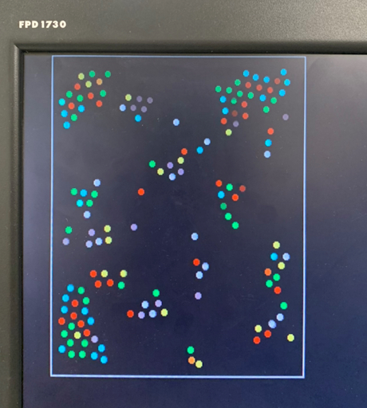

<!DOCTYPE html>
<!-- saved from url=(0141)file:///C:/Users/mpran/Documents/GitHub/MolecularDynamicsSimulation/docs/Welcome%20to%20GitHub%20Pages%20_%20MolecularDynamicsSimulation.html -->
<html lang="en-US"><head><meta http-equiv="Content-Type" content="text/html; charset=UTF-8">
    
    <meta http-equiv="X-UA-Compatible" content="IE=edge">
    <meta name="viewport" content="width=device-width, initial-scale=1, maximum-scale=1">
    <link rel="stylesheet" href="./index_files/style.css" media="screen" type="text/css">
    <link rel="stylesheet" href="./index_files/print.css" media="print" type="text/css">

    <!--[if lt IE 9]>
    
    <![endif]-->

<!-- Begin Jekyll SEO tag v2.8.0 -->
<title>Molecular Dynamics Simulation</title>
<meta name="generator" content="Jekyll v3.9.2">
<meta property="og:title" content="Molecular Dynamics Simulation">
<meta property="og:locale" content="en_US">
<meta name="description" content="2D Molecular Dynamics Simulation">
<meta property="og:description" content="2D Molecular Dynamics Simulation using Leonard Jones">
<link rel="canonical" href="https://pm623.github.io/MolecularDynamicsSimulation/">
<meta property="og:url" content="https://pm623.github.io/MolecularDynamicsSimulation/">
<meta property="og:site_name" content="MolecularDynamicsSimulation">
<meta property="og:type" content="website">
<meta name="twitter:card" content="summary">
<meta property="twitter:title" content="Molecular Dynamics Simulation">

<!-- End Jekyll SEO tag -->

    <!-- start custom head snippets, customize with your own _includes/head-custom.html file -->

<!-- Setup Google Analytics -->

<!-- You can set your favicon here -->
<!-- link rel="shortcut icon" type="image/x-icon" href="/MolecularDynamicsSimulation/favicon.ico" -->

<!-- end custom head snippets -->

  </head>

  <body>
    <header>
      

        <a href="https://pm623.github.io/MolecularDynamicsSimulation/">
          <h1>Molecular Dynamics Sim</h1>
        </a>
        <h2>2D Molecular Dynamics Simulation using Leonard Jones</h2>
        <h3 style="color:white">Praneeth Mogalipuvvu (pm623), Peter McGurk (pjm326), Tarun Iyer (tji8)</h3>
        
        <a href="https://github.com/pm623/MolecularDynamicsSimulation" class="button"><small>View project on</small> GitHub</a>

      

    </header>

    

      

        <section id="main-content">
          <h2 id="welcome-to-github-pages">Introduction</h2>

An Altera System-on-Chip FPGA with an integrated ARM hard processor system (HPS) was used as the development platform to perform a 2D molecular dynamics simulation of symmetrical, inert atoms.
   Molecular interaction was visualized on a VGA display with molecules represented as circles interacting with each other and changing colors corresponding to the amount of energy each molecule had.
    The visualizer worked in tandem with a C program running on the HPS to allow for user input to control the simulation from the command line, as well as a USB mouse.
     Memory manipulation via the Qsys bus allowed for configurable communication between the HPS and the FPGA as data was passed to the FPGA from the ARM, and vice-versa.
      Correctness of the system was continuously verified throughout development by analyzing waveforms in ModelSim, using the onboard LEDs and visualizing the output on the VGA Monitor.
       The objective was to efficiently utilize the resources on the FPGA to be able to visualize molecular interaction on a reasonable timescale.

<h2 id="welcome-to-github-pages">Demo</h2>

<iframe width="560" height="315" src="https://www.youtube.com/embed/mpDcrlHr-kI" title="YouTube video player" frameborder="0" allow="accelerometer; autoplay; clipboard-write; encrypted-media; gyroscope; picture-in-picture" allowfullscreen></iframe>

<h2 id="markdown">Motivation</h2>

Molecular dynamics is a notoriously computationally-expensive Newtonian modeling technique that has applications in everything from materials research to biochemistry. Given its complexity, acceleration of the simulation is an area that’s given significant research attention today. For our final project, we wanted to implement a 2D molecular dynamics simulation of a liquid that exhibits a phase change to a gas when a user adds energy to a system and vice-versa, in order to explore the viability of molecular dynamics simulations on an FPGA. Specifically, we want to observe phase changes when energy is added or removed from the system in the form of condensation/evaporation or crystallization/melting. Even though accurate molecular simulations require consideration of all 3-dimensions, we believe that creating a 2D version of the simulation can inform further efforts at accelerating the full 3-dimensional simulations.

<h2 id="markdown">Mathematical and Physical Background</h2>

The simulation is iterative and involves two distinct processes, force calculation, and motion integration. 

<h3 id="markdown">Leonard Jones Potential</h3>

The primary force of interaction for our simulation was the Leonarrd Jones (LJ) potential. The LJ model is great at capturing the interaction behavior between inert molecules because it captures the essential components of atomic interactions. LJ is a superposition of attractive and repulsive forces that give rise to an equilibrium atomic distance where the potential between the two atoms is minimized. Leonard Jones potential is given by the following equation.  

 

The repulsive term, proportional to 1/r12, captures electron repulsion due to the Pauli exclusion principle, where electrons in neighboring atoms cannot be allowed to occupy the same energy state, unless they have opposite spins. Orbitals of an inert atom are usually full, which means that bringing the electrons of these atoms close together requires an extreme amount of energy and is overall an unfavorable process. This repulsion is represented by the spike in potential with decreasing atomic distance as shown in the plot of the LJ potential below.  
  
 

The attractive force, proportional to 1/r6, captures dispersive interactions between atoms as a result of fluctuating partial charges on the surface of the atom. This should not be confused with bonding, which we model as an entirely different force. These types of weak interactions are akin to Van Der Waals forces which are a type of weak attractive interaction. The superposition of the attractive and repulsive forces yields a potential well at an equilibrium distance rm between atoms where the potential is minimized. Given the repulsive force is proportional to a much larger exponential, it falls off much more quickly with atomic distance than does the attraction, but it blows up exponentially on extremely small scales.   
  
In the first equation, epsilon is the dispersion energy, and regulates the depth of the potential well. Sigma is the distance where the particle interaction becomes zero. Both parameters can be manipulated depending on the types of molecules being simulated. The LJ potential captures basic phase changes very well which is why it was an appealing target for this project.   
  
To actually use the Loenard Jones potential in a force calculation, a derivative needs to be taken in order to calculate.  
 
  
  
In order to increase computational efficiency, the LJ potential is never directly calculated, because only the resulting force is required. As such, only the above equation appears in the project implementation.  
In the project, when calculating the LJ force we not only had to update the acceleration of the particle under question, but apply the opposite force (and associated acceleration) in the opposite direction to the particle that it's being compared to, in order to obey Newton’s 3rd law of motion. The record keeping of particle characteristics like position, acceleration, and velocity is discussed later. 

<h3 id="markdown">Other Forces</h3>

Other forces necessary in making the simulation look realistic were elastic boundary interactions and elastic bond forces. Boundaries were treated as a stiff spring. The boundaries were not the borders of the VGA but boundaries of a drawn in box - the reason for this is discussed in detail later. If particle position ever exceeded the boundaries of the box a spring force F=-kx was applied to the particle. The k parameter was made sufficiently large so as to simulate a bounce off a hard wall. Gravity was made toggleable by the user and was the simplest force to implement. It just included a constant downward acceleration in the y direction on all particles. Particle bonding was modeled as another spring force. If two particle positions were within a defined radius of each other a force F=kx and F=ky were added to the x and y accelerations of the particle under question. Again, equal forces in opposite directions were applied to the other particle to obey Newton’s 3rd law. The k of this force was smaller and in the opposite direction than the k of the boundary interaction, but made a significant difference when it came to particle attraction. The repulsive force captured by the LJ force was so significant that it balanced the attractive forces of LJ itself as well as the attractive bonding forces.

<h3 id="markdown">Verlet Algorithm  </h3>

The Verlet algorithm is the numerical method we used to calculate updates to particle position based on the total force of each particle. The algorithm is generally used to integrate Newton’s equations of motion and is commonly used in calculating particle trajectories in molecular dynamics simulations. The acceleration on each particle is directly calculated using the positions of all the particles at any given time. After we have calculated the net acceleration on all of the particles due to the forces described above,  the following equations are used to calculate the updates to particle position and particle velocity.  

 

This makes it necessary to recalculate position, velocity, and acceleration for every particle on each timestep. The velocity equation above is approximated in our implementation to just use a(t) instead of using the average acceleration of the current and next timestep. We found that this approximation in our simulation made little difference in the visual accuracy of the physics. To reiterate, on every timestep the algorithm uses the current locations of the particles to calculate, using the physics described above, the total forces on each particle. Acceleration is exactly equal to force in this case because we just set particle mass to 1 with arbitrary units. These accelerations are used to calculate the next position and velocity of each particle on every timestep. This continues cyclically until the process is killed by the user.  

<h2 id="markdown">System Design</h2>
<!-- 
The flow of information in this lab is as follows: user input is communicated to the ARM via a C program running on the ARM through a USB mouse and input at the command line to control program state. The ARM, a bus master for communication on the Cyclone V board, passes particle positions to the FPGA via PIO ports where the hardware corresponding to the acceleration calculation for the simulator has been stored. A single solver on the FPGA reads in a pair of particle positions and calculates the forces on each particle due to the other. These forces are sent back to the ARM via PIOs where the ARM collects them and updates particle positions accordingly using the verlet algorithm. Particles are displayed in the top left region of the VGA from the ARM.
 -->

<h3 id="markdown">High Level Design Considerations</h3>

By simulating in 2D instead of 3D, we would immediately reduce computational complexity by 1 degree of translational freedom, and at least two degrees of rotational freedom. Since we are choosing to model symmetric molecules with symmetric charge distributions this would reduce complexity by another 1 degree of rotational freedom. Therefore, we expect to be able to model 200-500 molecules without exceeding the resources on the FPGA while still being able to visualize them moving in real time.  

  The time complexity of some select forces like interaction with the border wall is O(n) so, with a limited number of molecules in simulation, these calculations could easily be run in parallel on the HPS. Calculating the Leonard Jones interaction has a time complexity closer to O(n2) and would benefit from acceleration on the FPGA. The forces being calculated in parallel would need to be summed on the FPGA to then calculate the motion of each particle. LJ has terms with 1/r6 and 1/r12 dependencies. It might make sense to avoid direct computation of 1/r and opt for a lookup table for computational efficiency, although it has been reported that direct computation has been found to be more efficient in terms of logic utilization.  
  
  Additionally, real atomic vibration is on the order of GHz. This introduces an interesting challenge with visualization on the VGA. There needs to be some augmentation of data produced by the motion calculation such that particle motion can be visualized. This can be handled by playing with the discrete time step used in the verlet calculation such that vibrations can be visualized.  We could never simulate anything close to real vibrational frequencies anyway (especially because the system is clocked in MHz). In this way, the vibrational frequencies would be naturally reduced by slow computation.  
  
  Another hugely important design consideration for this project was the numerical precision. We’ve mentioned before that some of the units are arbitrary. This is essentially to scale up numbers so that they can be represented with fewer decimal points. Particle mass for example is assumed to always be 1. This certainly isn’t in grams, but it’s scaled so that floating point notation on the FPGA isn’t necessary. In a similar fashion, particle position was measured in pixels. That's not to say they were treated as integers the whole time. Floating point values were allowed during intermediate calculations but cast back to ints as soon as anything needed to be drawn to the VGA. On the FPGA side, 10.17 fixed point notation was used. 27 bits total were used so that we could use the multipliers in the DSP blocks in our solvers. 17 bits afforded us about 5 decimal places in base 10 format which we determined from many simulations in modelsim would keep our error relative to the floating point version to less than ~5%. This, we decided, was enough to maintain good visual accuracy of the physics. This meant that for larger quantities like particle position we had only 9 bits (because of the sign bit). Our solution to this problem was to limit particle position to the top left quadrant of the VGA so that particle positions could never cause overflow in our hardware. We initially tried to use floating point notation but the added precision was not worth the reduction in multipliers per solver. With fixed point we used 8 multipliers per solver while floating point required triple that.  
  
  In a similar vein to the numerical precision considerations, we had to figure out how to implement division in fixed point notation. This was determined to be best implemented using a lookup table which allowed our solvers to stay combinational, but more on this later
    

<h3 id="markdown">Overall System Design</h3>

The flow of information in this project is as follows: user input is communicated to the ARM via a threaded C program running on the ARM through a USB mouse and command line inputs. The ARM, a bus master for communication on the Cyclone V board, passes that information to the FPGA via PIO ports where the hardware corresponding to the acceleration solvers has been stored. The solvers read in particle position pairs from the PIOs and calculate the forces those two particles exert on each other, passing them through separate PIOs back to the ARM, so the C program running on the ARM can use those accelerations to compute a step of the verlet algorithm. The C program calculates the new positions of all the particles and draws them to the VGA display.  
The number of particles on screen is controlled by clicking the mouse on the VGA inside a “container”. This container is really just a vector field of accelerations on the VGA that directs particles inside of it, essentially simulating a container to hold the particles. The ARM controls all things VGA, by drawing the box, the mouse cursor, and the particles when needed. Each particle pair is iterated over during every step of the computation. Particle color is mapped using a linear scale corresponding to particle speed. The communication of particle positions from the ARM to the FPGA occurs as a memory mapping via PIO ports instantiated in the Quartus II software. The C program executing on the ARM takes user input in the form of command line inputs to configure the program, and mouse inputs to increase the number of particles on screen and their spawn location. Toggling gravity, adding and removing energy from the system, and changing the box size are some of the user actions the program allows.  
Each solver has its own set of PIOs to communicate with. The reason for this is it would only serve to reduce computation speed. The forces on each particle pair can be calculated within a single cycle so we wanted PIO communication to be parallel in hardware to support whatever speed the ARM could write to the PIOs at. Using a control module to arbitrate particle-pairs to the solvers would introduce a non-negligible start delay for each solver. As such, the number of solvers is not parameterized but fixed at 10. On every cycle of the Verlet algorithm the ARM queries the 10 solvers and passes them particle-position pairs, then immediately reads out the total force on each particle. Updates to the VGA happen in a user configurable time frame in terms of how many steps the algorithm should take before it redraws the VGA one time. Increasing the number of steps per draw can help reduce the computational load of drawing to the VGA, but reduces particle movement resolution. The ARM keeps track of particle parameters like position, velocity, and acceleration necessary for the verlet updates.  

<h3 id="markdown">C Program design</h3>

The C program has four primary functions. The first is handling user input.  To enhance the UX, a mouse was integrated into the system. Raw data is parsed from the mouse driver in the Linux dev directory and presented to the program in a usable format. X and Y deltas are used to change the draw location of the mouse to the VGA. Every time the mouse is moved, its old location is cleared before its new location is drawn, to prevent continuously redrawing the same shape. To maintain an accurate record of the position, the mouse is initialized to be at the center of the screen and the relative change is accumulated to calculate the current position. The mouse cursor is represented as a hollow circle, which when clicked adds a number of new particles to the screen with randomly initialized positions and velocities. The UI also takes user input at the command line to control the program state. “g” toggles gravity, “w” adds energy to the system, “s” removes energy from the system, “a” shrinks the particle container, and “d” makes the container larger. The removal/addition of energy is handled by subtracting/adding a factor to the current velocity. The user input information is handled in a separate thread.  

The second primary function in C is the implementation of the Verlet algorithm. The verlet algorithm handles the position updates of all the particles. The update itself has linear time complexity because each particle on screen must be iterated over. Calculating the acceleration required for the verlet update has O(n2) time complexity so C relinquishes control of this portion of the algorithm to the FPGA by writing particle-position pairs to PIOs for hardware solvers to access. The hardware solvers immediately write the results back to the ARM. Mapping to the required memory addresses (previously configured in Qsys as PIO ports) was done using the M-map function which calculated virtual addresses corresponding to the physical memory addresses assigned to the PIOs. The virtual addresses in C could be directly written to and read from.   
  
The third responsibility of the C program was as a record keeper. Because the verlet algorithm needed to be implemented in C for reasons discussed previously, we also needed to track the particle accelerations, velocities, and positions. This was done by storing data in arrays.  
    
The fourth and final responsibility of the C program was drawing to the VGA. It drew the container, the mouse cursor, and all the particles corresponding to the array of particle positions. A separate function determines the color of the particles based on the current velocity of that particle. The VGA was not drawn on every iteration of the verlet algorithm. A user configurable parameter was set to determine the number of verlet steps to take for every draw to the VGA. We did not anticipate any bottlenecks with drawing to the VGA given we were only using a small portion of the display.  

<h3 id="markdown">Hardware design</h3>

The hardware design underwent a number of iterations as we experimented with number precision and hardware efficiency. The very first implementation of the acceleration solver included a sequential unit which implemented distinct portions of the force calculation on different clock cycles. This was done with the intention of using a single lookup table so that reads from the table from parallel solvers could be staggered. The lookup table for the 1/r (really 1/r2) calculation was initially >2000 elements large. This had an enormous impact on the total logic utilization and allowed only 1 table to exist on the FPGA at any given time. The pipelined solvers were relatively inefficient because they still required the same total number of multipliers to be used, and required staggering the startup of all the solvers by a single cycle to ensure that they could read from the single lookup table.   

R here is the distance between particles. The Leonard Jones force fell off so quickly that after a distance of 16 pixels apart we considered that force to be negligible in the hardware implementation. The 1/r2 lookup then needed to cover a range 0-255 (we indexed into the table with r2). The original strategy included having a fixed point lookup for every increment of 0.2 in the 0-255 range. The design checked for the highest threshold that the lookup number was less than and assigned a 10.17 fixed point number corresponding to 1/r2. We realized that the precision of the lookup table only really mattered when particles were extremely close to each other due to the highly exponential repulsive portion of the LJ force. We therefore amended the table to include a variable precision lookup. The new implementation included higher precision (increments of 0.2) for r^2 between 0-50, and a coarser lookup (increments of 2) beyond that. These optimizations lead to a table of ~300 entries. This allowed us to instantiate a lookup table for every individual force solver. All the lookup tables were generated procedurally in matlab by using basic binary operations to convert decimal to fixed point and appending strings together to produce something that looked like verilog.  
  
Given the setup cost and general inefficiency of the pipelined solvers, and the fact that the lookup table was made much smaller with no observable changes in the physics, we abandoned that design altogether. The next acceleration solver design was purely combinational, which offered a significant increase in speed. The Leonard Jones force and the bond forces for a particle pair were calculated step by step. First, the differences in the x and y positions of the two particles were calculated. These deltas were both squared, and r2 was assigned to the sum of both these distances. This was done to avoid taking the square root. A lookup was performed using r2 to calculate 1/r2, regardless of the particle distance. Any number greater than the threshold was assigned 0. The attraction was calculated as the product of (1/r2) << 6 by itself twice to get the 1/r6 attraction term of the LJ equation. The left shift by 6 is essentially the sigma term of the LJ equation which governs the interaction distance. This was experimentally determined to be a stable value based on our simulation, and just required a bit of tweaking to figure out. Repulsion was calculated in a similar fashion but as the square of the attraction. We mentioned previously that the LJ potential was not useful, only the force itself. This is true, but calculating the potential saves a number of multipliers. A good approximation to the subsequent derivation is dividing the potential by r2 and multiplying by the x and y distances between the particles. This yields the total acceleration due to LJ. Some control logic was required to regulate the stability of the simulation. A consequence of the fixed point arithmetic and the approximation from the lookup table was that occasionally, the attractions and repulsion may experience a sharp spike when the particles come very close to each other (i.e. the particle positions overlap). This tremendous increase in acceleration causes a ripple effect when the particles interact with each other and destabilizes the entire system. To prevent such anomalies, both the attraction and repulsion were capped which kept the system stable. It was also possible that the squared distance between particles was large enough to overflow our fixed point notation, so a check on the individual x and y squared distances was required before data from the r2 lookup could be used.  In a similar fashion, an elastic spring force was added to the total x and y components of each particle acceleration so long as they fell within a certain radius of one another.  
  

<h2 id="markdown">Results</h2>

  Relative to a pure C implementation, the physics captured were indistinguishable. This was a huge success given the use of fixed point notation to record acceleration and position in the FPGA implementation, and it validated all of our verification testing in modelsim to ensure we maintained high number precision. Additionally, it indicated that the discrete lookups performed for the 1/r calculation were good enough, and that the hybrid fine/course lookup strategy used was working. In terms of speed, the FPGA implementation was observed to be slightly faster than the C implementation. It should be mentioned that the C implementation was a barebones version of the simulation, and did not capture all the physics modeled in the final version nor include all the UI features that required threading the application. Even with these factors working in favor of the C implementation, it could only handle about 100 particles before slowing significantly. “Slowing” is an ambiguous term, but it can be thought of as the frame rate dropping to a point where individual frames are distinguishable to the eye. The same effect was observed on the FPGA implementation around 150 particles. Additionally, phase changes were successfully observed in the molecular simulation.
  When gravity is turned on the molecules seem to form fit the container just as a liquid would. Figure 1 demonstrates the composition fitting the container.  

   

  Figure 1. Molecules fit container like a liquid when gravity is toggled  
  
  The interesting part about adding and removing energy from the system is that the changes were not permanent. When energy was added to the system, the atoms would fly apart as bonds broke and the LJ potentials were escaped. Atoms would fly around the screen at high velocity and collide into the walls and each other without reforming bonds or getting stuck together. To do this though the add energy command in the user interface would have to be “spammed”. In other words, we would have to continuously add energy to keep the molecules in the simulated gas phase. Something about the modeled physics implicitly damped particle motion so that after a short period of time without adding energy we would observe a phase change back to the liquid state. This change is shown in Figure 2 below.  
  
  
  
  
   
   
   
   
   
   
  
  
  
  
  Figure 2. Progression of condensation without gravity for a system with > 100 particles  
  
  
  Initially energy was added by the user to start the system in the gas phase. Figure 3. demonstrates the implicit cooling effect we observed in the simulation. When given time to equilibrate clusters of molecules started to form and then larger ones would form as smaller ones collided with them. The opposite was true in the solid phase. Cooling the composition down continuously would leave molecules in a rigid crystal structure. Due to the way we handled bonding, each atom would form a bond with 6 neighbors, and a 2D hexagonal structure was observed.  
  
  
  
   
  
  
  Figure 3. 2D Hexagonal solid structure  
  
  Left to equilibrate, the LJ interactions would lead to melting back into the liquid phase as particules started to interact and move again. Even in the liquid phase though, an organized structure could be observed. This suggests that the equilibrium state was a hybrid between a liquid and a solid. A lolsquid if you will. We also allowed the user to control the size of the container that the particles were in. Making the box smaller had an effect similar to what would be observed with adiabatic compression. Initially, as the box became smaller, particle interactions resulting from the shifting sides formed something similar to a wave  
  
  
   
  
  
  Figure 4. Wave like motion due to the user manipulating the size of the box.  
  
  As the box became small enough to inhibit molecular motion, forces on the boundaries forced closer intermolecular interaction.  
  
  
   
  
  
  It’s hard to tell from a static picture, but when visualized in real time its clear the atoms are vibrating at much higher frequencies. This means their average velocity is greater and hence the temperature of the system is higher. We did not explicitly monitor or regulate temperature here, but used molecular speeds as a proxy. This is consistent with the result of adiabatic compression of a substance.   
  

<h2 id="markdown">Future Work/ What We Would do Differently</h2>

The original goal of the project was to simulate water freezing. We underestimated the numerical complexity of the project (discussed in the numerical considerations section about required precision, number format, etc.) which took a lot of time to master, and led to us aiming for a more attainable final goal. We were still able to observe lots of interesting physics, as well as phase changes, in the inert molecule simulation we produced. Now that the groundwork has been laid for molecular dynamics simulations on the FPGA, we wanted to offer our perspective in hindsight about what could be improved/ what direction the project should be taken in for any future groups looking to work on something similar.  

The reason we only performed the force/acceleration calculation on the FPGA was an issue of numerical precision, and limited FPGA resources. The position update in the verlet algorithm without a doubt required floating point precision due to the a(t)*t2 component. This meant that in order to avoid using a floating point unit on the FPGA (which required 3 DSP block multipliers per multiply), we had to run that calculation on the ARM. The consequence of this was that the ARM then also needed access to the position, velocity, and acceleration arrays, so it became the record keeper for the simulation. As a result, it also made sense to draw to the VGA from C since it had the record of all particle positions. As an aside, we were never concerned about drawing to the VGA because we were only utilizing a small fraction of the VGA at any given time. Doing the verlet update in C is okay because it has O(n) time complexity, but it introduced a bottleneck in communicating particle pairs to the solvers because we still needed to complete as many transactions over PIOs as there were particle pairs because the FPGA did not have its own record of particle positions, nor did with think it was a good idea to maintain separate lists that we would have to synchronize. Our rate limiter then seemed to be the PIO transactions.   
  
One thing we could have done differently is by allocating a block of shared SRAM that the ARM could write all particle positions to, and then another block that the solver would write the updated accelerations to. On the ARM side, this would mean that instead of writing all particle pairs to PIOs, it would only have to do writes and reads with O(n) time complexity. On the FPGA side though, the solvers would have to become sequential whereas in their current form they are combinational which we saw as a benefit to keeping the PIOs. The FPGA calculation would then have O(n2) time complexity anyways because pairs would still need to be read from the SRAM/M10k shared memory. It was not clear to us that this method was going to be faster than the first, especially considering the ARM is clocked at a much higher frequency.   
  
It seems then, that in order to truly accelerate the calculation on the FPGA everything must be done on the FPGA. The force calculation, the record keeping, the verlet update (in floating point), and drawing to the VGA. One potential problem in doing this is that we used lookup tables to calculate 1/r which had heavy logic utilization, so a logic resource constraint on the FPGA must be carefully avoided. It is a serious challenge, but one that could be doable with lots of careful planning.  

<h2 id="markdown">Conclusion</h2>

A Leonard Jones molecular dynamics simulation was implemented on an Altera System-on-Chip development platform. The simulation successfully demonstrated the interaction of hundreds of inert molecules on a reasonable timescale such that atomic vibrations could be visualized in real time. The simulation also demonstrated phenomena associated with inert molecules like phase changes and adiabatic effects during compression. Though we did not get all the way to simulating water, requiring a non-uniform potential distribution, the simulation still provides good insight into molecular dynamics and its viability on an FPGA. The project serves as a good basis for continued work, especially in the direction of acceleration (supporting more particles) or physical complexity (non-uniform potential distributions for asymmetric molecules).  

<h2 id="markdown">Team Member Contributions</h2>

<table>
  <tr>
    <th><b>Praneeth</b></th>
    <th><b>Peter</b></th>
    <th><b></b></th>
  </tr>
  <tr>
    <td>Webpage + C design</td>
    <td>C design</td>
    <td></td>
  </tr>
  <tr>
    <td>RTL design</td>
    <td>RTL design</td>
    <td></td>
  </tr>
  <tr>
    <td>RTL + C debugging</td>
    <td>RTL + C debugging</td>
    <td></td>
  </tr>
</table>

  

<h2 id="markdown">Bibliography</h2>

  The following videos and attached github repos were used as references when deciding on what physics was important to capture and how to design the algorithm.  
  <a href="https://physics.weber.edu/schroeder/md/interactivemd.html">https://physics.weber.edu/schroeder/md/interactivemd.html</a>  
  <a href="https://www.youtube.com/watch?v=P2Vw9CWD8YM">https://www.youtube.com/watch?v=P2Vw9CWD8YM</a>   
  <a href="https://www.youtube.com/watch?v=mBGaFP9HsQA">https://www.youtube.com/watch?v=mBGaFP9HsQA</a>   
  <a href="https://www.youtube.com/watch?v=j1GqnVs95BU">https://www.youtube.com/watch?v=j1GqnVs95BU</a>  
  

  
  The following academic references were useful in preliminary research for the project:  
  
  C. Yang, T. Geng, T. Wang, “Fully Integrated On-FPGA Molecular Dynamics Simulations,” ArXiv, 2019,
  <a href="10.48550/arXiv.1905.05359">10.48550/arXiv.1905.05359</a>  
  
  
  M. Chiu, M. Herbordt, “Molecular Dynamics Simulations on High-Performance Reconfigurable 
    Computing Systems,” ACM Trans Reconfigurable Technol Syst, vol. 3, 2010, 
    <a href="doi:doi:10.1145/1862648.1862653">doi:doi:10.1145/1862648.1862653</a>  
  
  
  M. Yasutomi, “ Interparticle Interactions Between Water Molecules” Frontier Physics, 2014, vol 18.
  <a href="https://doi.org/10.3389/fphy.2014.00064">https://doi.org/10.3389/fphy.2014.00064</a>
  

  

<b>The group approves this report for inclusion on the course website.
The group approves the video for inclusion on the course youtube channel.</b>

        </section>

        <aside id="sidebar">
          

          
          
<a href="https://github.com/pm623/MolecularDynamicsSimulation">MolecularDynamicsSimulation</a> is maintained by <a href="https://github.com/pm623">pm623</a>.

          
          
 The Team :
            <ul>
              <li>Praneeth Mogalipuvvu (pm623)</li>
              <li>Peter McGurk (pjm326)</li>
              <li>Tharun Iyer (tji8)</li>

            </ul>
          

          
This page was generated by <a href="https://pages.github.com/">GitHub Pages</a>.

        </aside>
      

    

  

</body></html>
